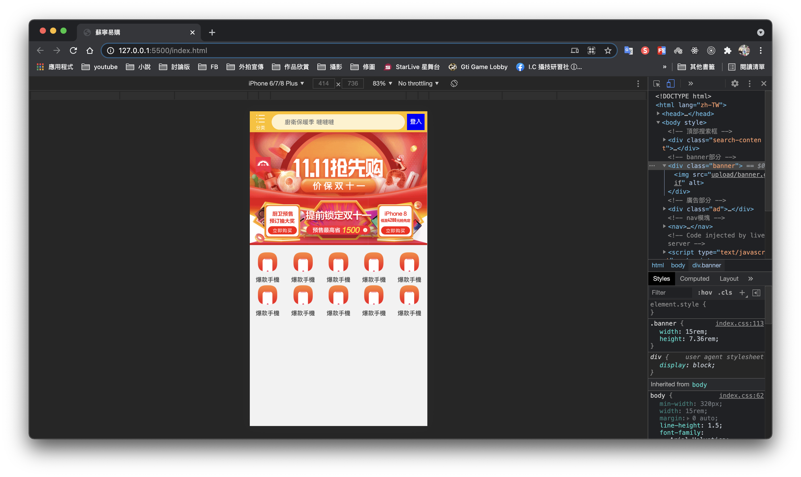

# HTML CSS 蘇寧易購 網頁製作

# Github展示

本網頁為學習使用，若有侵權請告知，謝謝！

https://ivesshe.github.io/HTML_CSS_Mobile_Suning/

# 配置

- 技術∶ 布局採購rem適配布局(less + rem + 媒體查詢)
- 設計圖∶ 本設計圖採用750px設計尺寸

# Less

Less(Leaner Style Sheets) 是一門CSS擴展語言，為CSS預處理器

# Less 編譯

安裝vscode插件 Easy LESS

安裝完成之後，編輯less文件存檔之後，會自動生成對應的css文件

# 完成畫面

紅框標示可按連結

## 直版畫面

## 橫版畫面

    
    
    